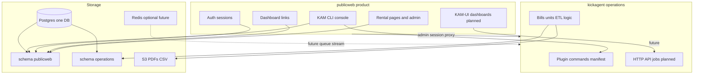

# Platform overview (publicweb + kickagent)

**Audience:** Developers and agents working across **publicweb** and the sibling **kickagent** repo.

**Purpose:** One mental model for product boundaries, Postgres ownership, storage, and UI surfaces (KAM vs KAM-UI). For host/plugin wiring details, see [contracts/publicweb-kickagent-consumer.md](contracts/publicweb-kickagent-consumer.md) and [kam-console.md](kam-console.md).

---

## Roles

**publicweb** is the authenticated web product: production rental marketing pages, team hub, admin for rental configuration, and the **KAM host** (command palette, console, klog, manifest load). Future **KAM-UI** dashboards will be the primary office control surface in this repo.

**kickagent** is the headless operations engine: bill/unit domain logic, ETL, CLI, plugin commands (`kickagent:*`), and (planned) HTTP job API. It can be consumed by publicweb or, in principle, other frontends via the same API boundary.

publicweb does **not** own long-term business logic for utility bills, units, or back-office batch work; kickagent does.

---

## Architecture

---

## Postgres: one database, two schemas

Use **one Postgres instance** (one `DATABASE_URL`) with **two schemas** for clear ownership. Cross-schema SQL joins are possible but **application code should treat schemas as boundaries**—publicweb does not own `operations` tables; kickagent does not own `publicweb` tables.

| Schema | Owner repo | Tables (current names in [`src/lib/server/schema.ts`](../../src/lib/server/schema.ts)) | Notes |
|--------|------------|----------------------------------------------------------------------------------------|--------|
| **`publicweb`** | publicweb | `users`, `sessions`, `rental_landing_links`, `dashboard_links`, `user_dashboard_link_preferences`, `klogs` | **Production-critical:** `rental_landing_links` must not be broken by migrations |
| **`operations`** | kickagent | `units`, `unit_bill_accounts`, `bill_documents`, `bill_runs`, `bill_monthly_files`, `bill_monthly_file_items` | Today these tables live in the public schema via publicweb Drizzle; **target** is kickagent-owned migrations under `operations` |
| **Cross-boundary** | convention | `user_id` UUID on ops audit rows and `klogs` | Reference by id only; **no cross-schema foreign keys** in the target design |

Future **KAM-UI** layout and widget preferences will live in **`publicweb`** (tables TBD).

---

## Storage

| Layer | Technology | Role |
|-------|------------|------|
| **Kickagent** | Postgres (`operations` schema) | System of record for units, bills, runs, audit |
| **Kickagent** | S3-compatible object store | PDF intake, parse snapshots, Appfolio CSV outputs — see [utility-bill-etl-scope.md](utility-bill-etl-scope.md) |
| **Kickagent** | Redis (optional, future) | Queue, coordination, or integration with an existing third-party Redis data ecosystem — **not in scope for initial schema work**; document only |
| **Publicweb** | Postgres (`publicweb` schema) | Users, rental config, dashboard links, klogs, future KAM-UI prefs — modest volume |

Env: `DATABASE_URL` (and `DATABASE_URL_DEV` locally) serves **both** schemas on the same server. A separate `OPERATIONS_DATABASE_URL` is only needed if we later split physical databases.

S3 credentials (`UTILITY_BILL_S3_*` in [`.env.example`](../../.env.example)) are **operations** concerns even when configured in the publicweb deploy today.

---

## Product surfaces

| Surface | What it is | Status |
|---------|------------|--------|
| **KAM** | CLI: command palette (`Ctrl+/`), KAM Console pane, `kickagent:*` commands, manifest reload (`kam:reload-kickagent`), klog | Implemented — [kam-console.md](kam-console.md) |
| **KAM-UI** | Configurable dashboards for the same kickagent capabilities (control + feedback) | **Planned** — primary future publicweb design work |
| **`/tools/*`** | *(removed)* | Replaced by kickagent + KAM-UI; behavior captured in [upgrade primers](../upgrade/README.md) |

KAM and KAM-UI share one **engine** (kickagent commands / API); they differ only in **presentation** (terminal vs dashboards).

---

## Production vs incubating

| Area | Production? | Rule |
|------|-------------|------|
| Rental pages (`/cda`, `/mos`, `/spt`, vanity hosts) | **Yes** | Do not remove or break routes or `rental_landing_links` data |
| Admin rental configuration (`/admin/rental-links`, etc.) | **Yes** | May reorganize in nav; must remain functional |
| Auth (`users`, `sessions`) | **Yes** | Required for admin access |
| Hub dashboard links | Incubating / internal | Safe to evolve |
| KAM console | Incubating | Active development |
| `/tools/*` | **Removed** | See [docs/upgrade/](../upgrade/README.md) for handoff to kickagent |
| Bills / units / reports logic | Incubating | Moves to kickagent + KAM-UI |

---

## Phased roadmap (not commitments)

1. **Documentation** (this guide) — shared boundaries.
2. **Schema migration** — Drizzle `pgSchema('publicweb')` / `pgSchema('operations')`; `ALTER TABLE … SET SCHEMA`; kickagent repo owns `operations` migrations long-term.
3. **kickagent API (Phase 3)** — server-side jobs; publicweb `/api/kickagent/*` proxy; SSE → klog.
4. **KAM-UI v0** — e.g. document queue + job status widgets calling the same API as CLI commands.
5. **Retire `/tools`** — done in publicweb; implement parity in kickagent + KAM-UI.

---

## Related docs

| Doc | Topic |
|-----|--------|
| [contracts/publicweb-kickagent-consumer.md](contracts/publicweb-kickagent-consumer.md) | Host/subscriber phases, security, commands |
| [contracts/README.md](contracts/README.md) | Cross-repo contract index |
| [kam-console.md](kam-console.md) | KAM UX, aliases, kickagent mode |
| [utility-bill-etl-scope.md](utility-bill-etl-scope.md) | Bills pipeline scope and S3 keys |
| [../upgrade/README.md](../upgrade/README.md) | Handoff primers (bills, units, reports) after `/tools` removal |
| [production-operations.md](production-operations.md) | Operators: vanity, rental links |
| [kickagent/docs/publicweb-integration.md](../../../kickagent/docs/publicweb-integration.md) | Kickagent-side entry for publicweb devs |
| [kickagent/docs/platform-overview.md](../../../kickagent/docs/platform-overview.md) | Kickagent-focused summary (same architecture) |
