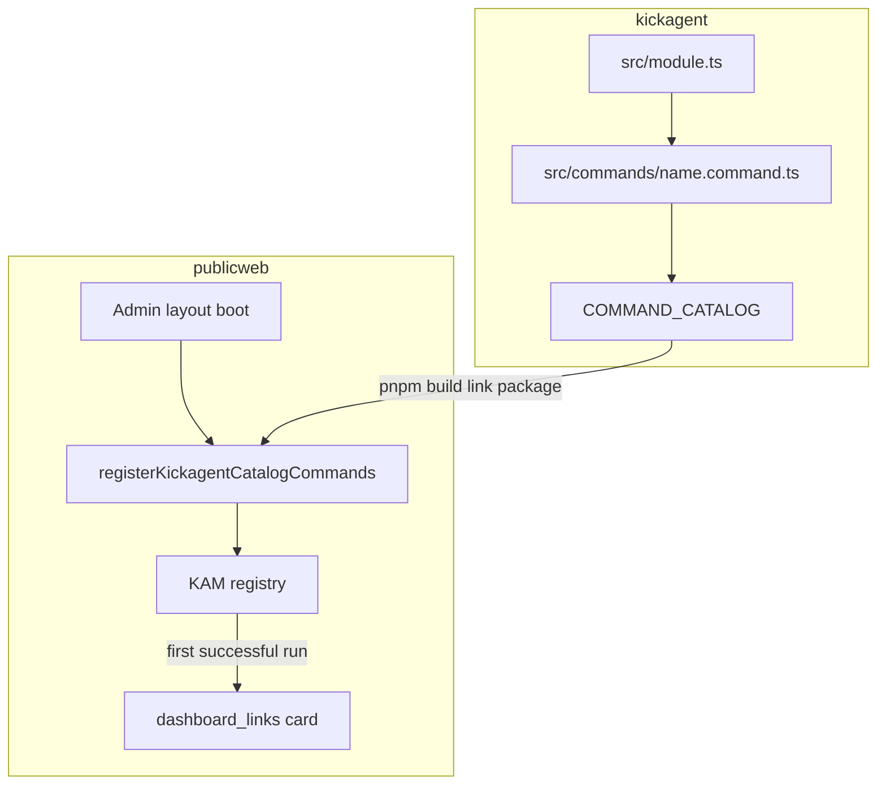

# Register a new kickagent command

**Audience:** Developers and Cursor agents adding a `kickagent:*` command that runs in publicweb KAM and (optionally) appears on the ops hub.

**Source of truth for command metadata:** kickagent `COMMAND_CATALOG` in [`../../kickagent/src/commands/index.ts`](../../kickagent/src/commands/index.ts). Generated table: [`../../kickagent/docs/commands.md`](../../kickagent/docs/commands.md).

---

## Overview

| Layer | What you do |
| ----- | ----------- |
| **kickagent** | Implement behavior + one `defineCommand` row in `COMMAND_CATALOG` |
| **publicweb** | Usually **nothing per command** — host registers the full catalog on admin login (Phase 1) or manifest reload (Phase 2) |
| **KAM** | Run `kickagent:<name>` to verify |
| **Ops hub** | Card appears **after first successful run** (lazy materialize); customize under Settings → Dashboard |



---

## 1. kickagent (required)

1. **Implement** behavior in `kickagent/src/<module>.ts`:
   - Use `KlogBroadcaster` for output (no `console.log`).
   - Return structured results from handlers as documented in [kickagent AGENTS.md](../../kickagent/docs/AGENTS.md).

2. **Add** `kickagent/src/commands/<name>.command.ts`:

   ```ts
   import { defineCommand } from "./types.js";
   import { myFn } from "../myModule.js";

   export const myCommand = defineCommand({
     name: "my-cmd",           // lowercase, hyphens OK → KAM: kickagent:my-cmd
     description: "What it does",
     category: "Tools",        // required — ops hub column name
     execution: "local",       // local | remote
     sortOrder: 0,             // optional hub default sort
     implementation: "myFn",   // optional — docs only
     handler: async (_args, ctx) => {
       const res = await myFn(ctx.userId, ctx.userEmail, ctx.logger);
       return { log: res.message, level: "info" as const };
     },
   });
   ```

3. **Register** in [`kickagent/src/commands/index.ts`](../../kickagent/src/commands/index.ts): import the const and append to `COMMAND_CATALOG`.

4. **Build and test** (kickagent repo):

   ```bash
   cd ../kickagent
   pnpm build
   pnpm test
   pnpm docs:commands
   ```

5. **Version / publish** (when shipping):
   - Bump kickagent `package.json` semver (**minor** for new commands).
   - Phase 2: `pnpm publish:artifacts -- --base-url <origin>` and host reload (below).

**Do not:**

- Hand-edit `manifest.json` `commands[]` or duplicate registration in `plugin.ts` (derived from catalog).
- Use reserved short names: `exit`, `help`, `reload-kickagent`, etc. (see `defineCommand` validation in kickagent).

---

## 2. publicweb Phase 1 (linked package)

When **`PUBLIC_KICKAGENT_MANIFEST_URL`** is **unset** (typical local dev):

1. `pnpm build` in kickagent (sibling `link:../kickagent` picks up `dist/`).
2. **Restart** the publicweb dev server.
3. Sign in as **admin** — [`src/lib/kickagent/registerCatalogCommands.ts`](../../src/lib/kickagent/registerCatalogCommands.ts) registers **every** `COMMAND_CATALOG` row via [`src/routes/+layout.svelte`](../../src/routes/+layout.svelte).

**No per-command publicweb TypeScript** unless you are intentionally bypassing the catalog (exceptional).

---

## 3. publicweb Phase 2 (manifest URL)

When **`PUBLIC_KICKAGENT_MANIFEST_URL`** is set (see [`.env.example`](../../.env.example)):

1. Build kickagent and publish manifest + ESM bundle ([plugin-manifest-and-reload.md](../../kickagent/docs/guides/plugin-manifest-and-reload.md)).
2. Restart publicweb or run **`kam:reload-kickagent`** in KAM after republishing.
3. Plugin `register()` uses the same catalog; manifest `commands[]` includes **`category`** for hub materialize defaults.

---

## 4. Verify in KAM

As admin:

| Input | When |
| ----- | ---- |
| `kickagent:<name>` | Works in any shell mode |
| `shell kickagent` then `<name>` | Kickagent shell only |
| `Ctrl+/` palette | Same as console |

**Success:** klog lines in the KAM Console pane (`` ` `` to focus).

**Failure:** `unknown command: …`

- Phase 1: kickagent not rebuilt, or publicweb dev server not restarted after build.
- Phase 2: stale manifest — republish and `kam:reload-kickagent`.
- Command missing from `COMMAND_CATALOG` or invalid `name` pattern.

See [kam-console.md](kam-console.md) for shell mode, aliases, and `:help`.

---

## 5. Ops hub command card (optional)

Hub cards are **lazy**: the command does not appear on `/` until it has been **run successfully once**.

1. Run `kickagent:<name>` as admin (palette, console, or hub **Run** on an existing card).
2. Host calls `POST /api/dashboard/materialize-command` (automatic after successful `kickagent:*` in [`commands.ts`](../../src/lib/devConsole/commands.ts)).
3. Reload **`/`** — card shows under the command’s **`category`** column.
4. **Settings → Dashboard** — relabel, recategorize, sort, or hide per user.

Removing a card in Settings does **not** unregister the KAM command.

Details: [publicweb-kickagent-consumer.md](contracts/publicweb-kickagent-consumer.md) (Ops hub command cards).

---

## Agent quick reference

| Touch | Path |
| ----- | ---- |
| Command definition | `kickagent/src/commands/<name>.command.ts` |
| Catalog list | `kickagent/src/commands/index.ts` |
| Implementation | `kickagent/src/<module>.ts` |
| Host auto-register (Phase 1) | `publicweb/src/lib/kickagent/registerCatalogCommands.ts` |
| Host manifest load (Phase 2) | `publicweb/src/lib/kickagent/loadPluginFromManifest.ts` |
| Hub materialize | `publicweb/src/lib/server/dashboardCommandMaterialize.ts` |

| Avoid | Reason |
| ----- | ------ |
| `registerKickagentCommand` in publicweb for catalog commands | Duplicates catalog; use `COMMAND_CATALOG` only |
| Edit manifest `commands[]` by hand | Generated from catalog |
| Expect hub card before first run | Lazy materialize by design |

---

## Related docs

| Doc | Topic |
| --- | ----- |
| [kickagent/docs/commands.md](../../kickagent/docs/commands.md) | Generated command table |
| [kickagent/docs/AGENTS.md](../../kickagent/docs/AGENTS.md) | Kickagent repo conventions |
| [contracts/publicweb-kickagent-consumer.md](contracts/publicweb-kickagent-consumer.md) | Host phases, security, hub |
| [kam-console.md](kam-console.md) | Palette, klog, kickagent shell |
| [platform-overview.md](platform-overview.md) | KAM vs KAM-UI architecture |
