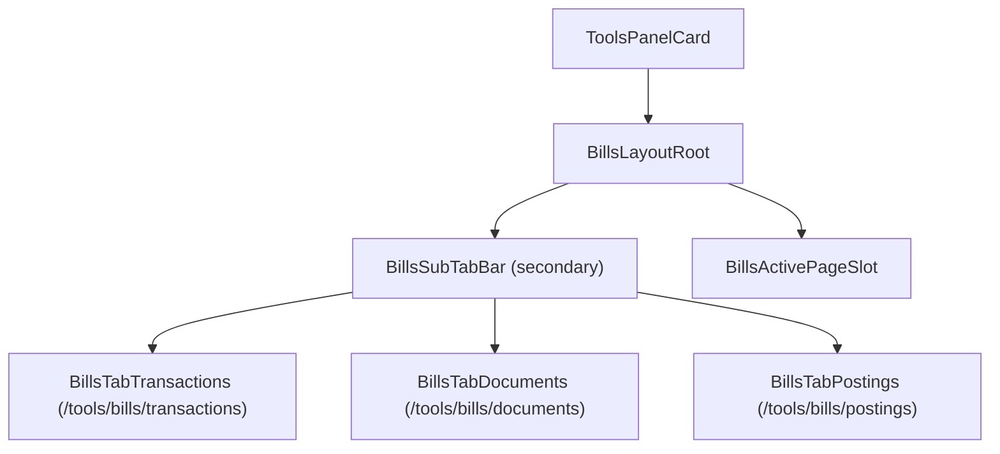
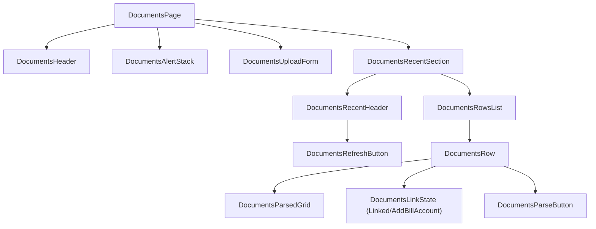
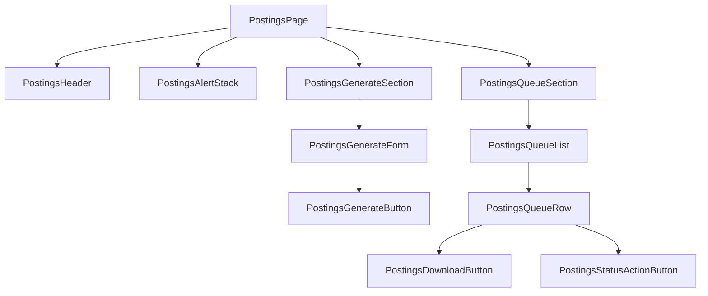
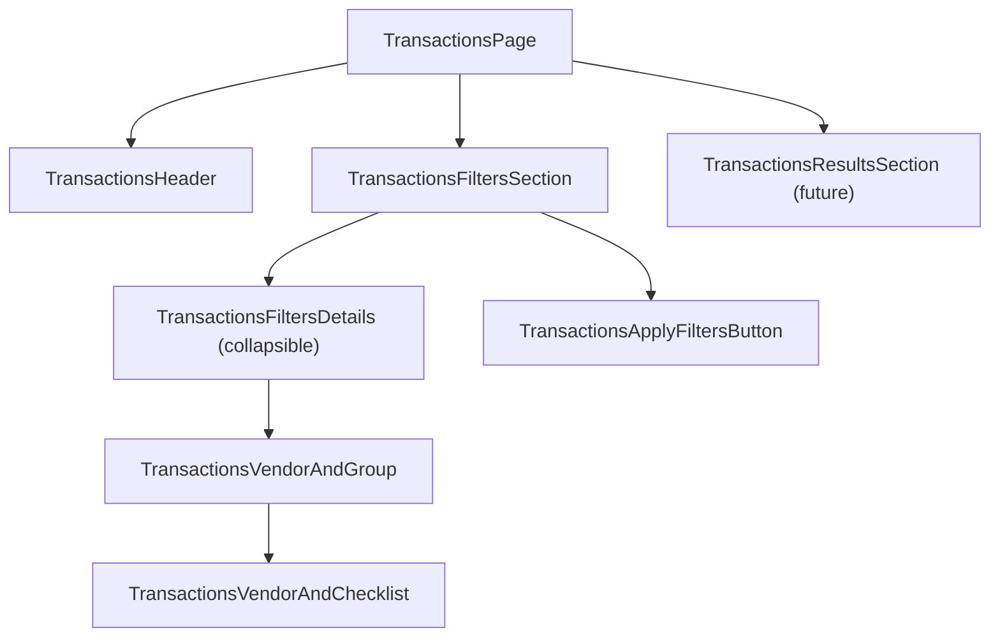

# Tools Bills UI Map

> **Status: legacy / sunset.** `/tools/bills` is a prototype. Target replacement is **KAM-UI + kickagent**. See [platform-overview.md](platform-overview.md). **Do not** delete route code until parity is reached.

This guide defines shared UI terms for `Tools > Bills` so prompts can target consistent component regions.

## Naming Conventions

- Use `Bills*` for shared layout and documents page regions.
- Use `Postings*` for postings page regions.
- Use `Transactions*` for transactions page regions.
- Use `*Page` for the route root container.
- Use `*Section` for major blocks inside a page.
- Use `*Form`, `*List`, `*Row`, `*TabBar`, `*Alert`, `*Button` for explicit UI roles.

## Global Layout Map

Source: `src/routes/tools/bills/+layout.svelte`

### Bills URL Namespace

- Bills index route: `/tools/bills` (resolves to last-selected sub-tab; defaults to `/tools/bills/transactions`)
- First visible tab: `/tools/bills/transactions`
- Documents tab: `/tools/bills/documents`
- Postings tab: `/tools/bills/postings`
- Transactions tab: `/tools/bills/transactions`



## Documents Page Map

Source: `src/routes/tools/bills/documents/+page.svelte`



### Documents Wireframe

```text
+---------------------------------------------------------------+
| DocumentsPage                                                 |
|  DocumentsHeader                                              |
|  DocumentsAlertStack                                          |
|                                                               |
|  DocumentsUploadForm                                          |
|   - category / vendor / city / file / UploadPDFButton        |
|                                                               |
|  DocumentsRecentSection                                       |
|   [DocumentsRecentHeader] [DocumentsRefreshButton]            |
|   DocumentsRowsList                                           |
|    - DocumentsRow                                             |
|       - row meta + parsed grid + link state + parse button   |
+---------------------------------------------------------------+
```

## Postings Page Map

Source: `src/routes/tools/bills/postings/+page.svelte`



### Postings Wireframe

```text
+---------------------------------------------------------------+
| PostingsPage                                                  |
|  PostingsHeader                                               |
|  PostingsAlertStack                                           |
|                                                               |
|  PostingsGenerateSection                                      |
|   PostingsGenerateForm                                        |
|    - category / vendor / city / period / GenerateBatchButton |
|                                                               |
|  PostingsQueueSection                                         |
|   PostingsQueueList                                           |
|    - PostingsQueueRow                                         |
|       - metadata + status + download + state action          |
+---------------------------------------------------------------+
```

## Transactions Page Map

Source: `src/routes/tools/bills/transactions/+page.svelte`



### Transactions Wireframe

```text
+---------------------------------------------------------------+
| TransactionsPage                                              |
|  TransactionsHeader                                           |
|                                                               |
|  TransactionsFiltersSection                                   |
|   [TransactionsFiltersDetails (collapsible)]                  |
|    - TransactionsVendorAndGroup                               |
|      [ ] Home Depot                                           |
|      [ ] Early Bird                                           |
|      [ ] Moscow Building Supply                               |
|   [TransactionsApplyFiltersButton]                            |
|                                                               |
|  TransactionsResultsSection (future list/table)              |
+---------------------------------------------------------------+
```

## Prompt Vocabulary Quick Reference

- "secondary bills tabs" -> `BillsSubTabBar`
- "documents upload area" -> `DocumentsUploadForm`
- "documents recent list header" -> `DocumentsRecentHeader`
- "refresh on documents list" -> `DocumentsRefreshButton`
- "link badge under parsed row" -> `DocumentsLinkState`
- "postings generate form" -> `PostingsGenerateForm`
- "postings queue row actions" -> `PostingsStatusActionButton`
- "transactions filter panel" -> `TransactionsFiltersSection`
- "transactions collapsible filters" -> `TransactionsFiltersDetails`
- "transactions vendor AND checklist" -> `TransactionsVendorAndChecklist`

## Example Prompt Phrases

- "In `DocumentsRecentSection`, add a compact status filter above `DocumentsRowsList`."
- "In `PostingsQueueSection`, move `PostingsDownloadButton` after the status action."
- "In `TransactionsFiltersDetails`, add a date range group under `TransactionsVendorAndGroup`."
