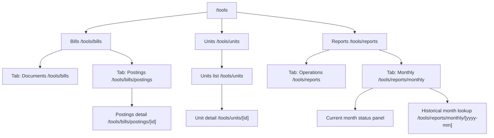

# Tools — Information Architecture

This is the **single source of truth** for the layout of the `/tools` area. Update this doc first whenever you change the top-level Tools nav, sub-tabs, or canonical URLs; then change the code to match.

## Top-level layout

## Route table

| Path                                            | Role                                                  |
| ----------------------------------------------- | ----------------------------------------------------- |
| `/tools`                                        | Redirects to `/tools/bills`                           |
| `/tools/bills`                                  | Bills → **Documents** tab (uploaded/parsed PDFs)      |
| `/tools/bills/postings`                         | Bills → **Postings** tab (Appfolio batch CSV queue)   |
| `/tools/bills/postings/files/[id]/download`     | Postings batch CSV download                           |
| `/tools/units`                                  | Units list                                            |
| `/tools/units/[id]`                             | Unit detail (edit + bill-account links)               |
| `/tools/reports`                                | Reports → **Operations** tab (on-demand operations)   |
| `/tools/reports/monthly`                        | Reports → **Monthly** tab (current-month + lookup)    |
| `/tools/reports/monthly/[yyyy-mm]`              | Historical monthly view for the given period          |

### Compatibility redirects

These exist so old bookmarks keep working. They are intentionally the **only** thing those paths do.

| Old path                                       | New path (308)                                  |
| ---------------------------------------------- | ----------------------------------------------- |
| `/tools/bill-runs`                             | `/tools/bills/postings`                         |
| `/tools/bill-runs/files/[id]/download`         | `/tools/bills/postings/files/[id]/download`     |

If you are adding new functionality, do **not** add it under `/tools/bill-runs/*` — it is a redirect-only namespace and will be removed once the redirects can be retired.

## Naming decisions

These names were chosen deliberately. Renaming them is a coordination cost, so don't churn them without an update to this doc.

- **Bills > Documents** (not "Bills"): the inner tab lists uploaded/parsed vendor PDFs ("documents"). Calling it "Bills" too produces an awkward "Bills > Bills" breadcrumb and confuses the parent category with a child view.
- **Bills > Postings** (not "Runs" / "Bill runs"): "posting" is the standard accounting term for the batch artifact that is sent to Appfolio. Acceptable fallback name if "Postings" ever needs to change: **Batches**. The verb form ("run a posting") is fine in code/comments; the noun used in the UI and URL is **Postings**.
- **Reports > Operations** (not "Exports" / "Tools"): on-demand, ad-hoc operations the user can trigger now. Reserved for things that don't have a natural period anchor.
- **Reports > Monthly** (not "Periodic" / "History"): period-anchored views — the current month plus historical month lookup. Anything tied to a calendar month belongs here.

## Out-of-scope notes

The Reports section is **scaffolding only** as of this doc's introduction — Operations and Monthly render placeholder "coming soon" panels. Real report content is tracked as separate tasks.
