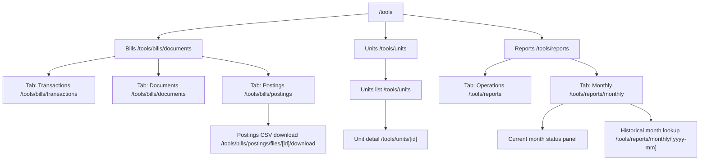

# Tools — Information Architecture

> **Status: legacy / sunset.** `/tools/*` nav and URLs are prototypes. Target replacement is **KAM-UI + kickagent**. See [platform-overview.md](platform-overview.md). **Do not** delete route code until parity is reached.

This is the **single source of truth** for the layout of the `/tools` area. Update this doc first whenever you change the top-level Tools nav, sub-tabs, or canonical URLs; then change the code to match.

## Top-level layout

## Route table

| Path                                            | Role                                                  |
| ----------------------------------------------- | ----------------------------------------------------- |
| `/tools`                                        | Redirects to `/tools/bills/documents`                 |
| `/tools/bills`                                  | Redirects to `/tools/bills/documents`                 |
| `/tools/bills/transactions`                     | Bills → **Transactions** tab (filter workspace)       |
| `/tools/bills/documents`                        | Bills → **Documents** tab (uploaded/parsed PDFs)      |
| `/tools/bills/postings`                         | Bills → **Postings** tab (Appfolio batch CSV queue)   |
| `/tools/bills/postings/files/[id]/download`     | Postings batch CSV download                           |
| `/tools/units`                                  | Units list                                            |
| `/tools/units/[id]`                             | Unit detail (edit + bill-account links)               |
| `/tools/reports`                                | Reports → **Operations** tab (on-demand operations)   |
| `/tools/reports/monthly`                        | Reports → **Monthly** tab (current-month + lookup)    |
| `/tools/reports/monthly/[yyyy-mm]`              | Historical monthly view for the given period          |

### Compatibility redirects

None. The `/tools/bill-runs/*` namespace previously held 308 redirects to the new Postings paths; it has been retired. If old bookmarks need to be preserved again, add a fresh entry here at the same time as the route.

## Naming decisions

These names were chosen deliberately. Renaming them is a coordination cost, so don't churn them without an update to this doc.

- **Bills > Documents** (not "Bills"): the inner tab lists uploaded/parsed vendor PDFs ("documents"). Calling it "Bills" too produces an awkward "Bills > Bills" breadcrumb and confuses the parent category with a child view.
- **Bills > Postings** (not "Runs" / "Bill runs"): "posting" is the standard accounting term for the batch artifact that is sent to Appfolio. Acceptable fallback name if "Postings" ever needs to change: **Batches**. The verb form ("run a posting") is fine in code/comments; the noun used in the UI and URL is **Postings**.
- **Reports > Operations** (not "Exports" / "Tools"): on-demand, ad-hoc operations the user can trigger now. Reserved for things that don't have a natural period anchor.
- **Reports > Monthly** (not "Periodic" / "History"): period-anchored views — the current month plus historical month lookup. Anything tied to a calendar month belongs here.

## Out-of-scope notes

The Reports section is live:

- **Operations** exposes a per-vendor "re-parse parsed bills" action and a confirmed "re-parse ALL vendors" action. Both reset matching `bill_documents` rows from `parsed` back to `received` so the parser will re-run on the next pass.
- **Monthly** loads document and posting metrics for the current month (and any historical YYYY-MM via the lookup form). Document counts are bucketed by `parse_status` over the UTC month window of `bill_documents.created_at`; posting counts are bucketed by `bill_monthly_files.status` filtered by `period`.

Add new operations as additional `?/<action>` form actions on `src/routes/tools/reports/+page.server.ts`. Add new monthly metrics by extending `src/lib/server/bills/monthlyMetrics.ts` so both the current-month panel and the `[period]` lookup pick them up automatically.
