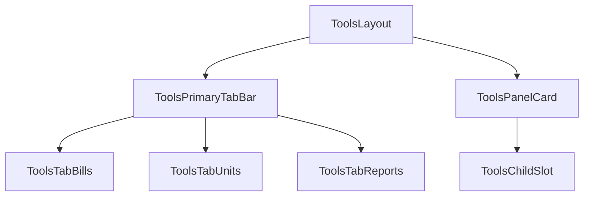
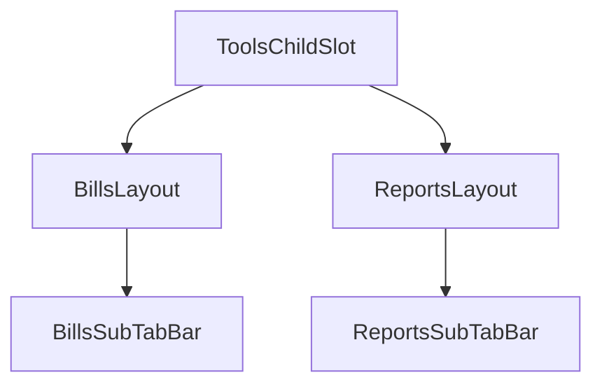

# Tools UI Map

Canonical UI map for `Tools` route-level containers and tab shells.

## Scope

- Primary Tools shell
- Bills and Reports secondary tab shells
- Route-level page containers (not deep internals; see route-specific UI maps)

## Global Tools map

## Nested tab shells

## Route container terms

- `BillsDocumentsPage` -> `/tools/bills/documents`
- `BillsPostingsPage` -> `/tools/bills/postings`
- `BillsTransactionsPage` -> `/tools/bills/transactions`
- `UnitsListPage` -> `/tools/units`
- `UnitDetailPage` -> `/tools/units/[id]`
- `ReportsOperationsPage` -> `/tools/reports`
- `ReportsMonthlyPage` -> `/tools/reports/monthly`
- `ReportsMonthlyPeriodPage` -> `/tools/reports/monthly/[period]`

## Related deep UI maps

- Bills deep map: [`tools-bills-ui-map.md`](./tools-bills-ui-map.md)
