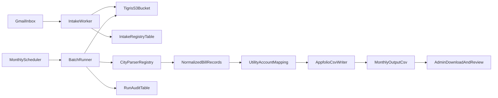

# Utility Bill ETL Scope

Scope for an automated monthly pipeline that converts utility-bill PDFs into an Appfolio-compatible bulk vendor bill CSV.

## Goal

Process utility invoices server-side from intake to CSV export with auditability, idempotency, and manual recovery paths.

Agreed assumptions:

- Source documents are vendor utility bill PDFs received through Gmail.
- Bills are processed monthly in batch.
- Extracted bill amount is current-period charges only (not total due including prior balance).
- Posting date is set equal to due date.
- City formats are stable per parser (Moscow first), with a parser class/module per city.

## Non-Goals (Initial Rollout)

- No client-side PDF parsing or client-side CSV generation.
- No generalized multi-vendor OCR pipeline in phase 1.
- No full accounting rules engine for all optional Appfolio fields.

## Architecture

Core components:

- Intake worker: fetches PDF attachments from Gmail and stores raw files.
- Storage adapter: S3-compatible adapter targeting `https://t3.storageapi.dev`.
- Parser layer: city-specific modules returning a normalized bill record.
- Mapping layer: maps utility account/service address to Appfolio property metadata.
- Batch runner: monthly execution that produces one CSV artifact per run/vendor.
- Audit store: tracks runs, per-document outcomes, and errors.

## Storage and Object Key Convention

Use S3-compatible keys to separate lifecycle stages and simplify operator debugging:

- `utility-bills/raw/{vendor}/{yyyy}/{mm}/{sourceMessageId}/{filename}.pdf`
- `utility-bills/parsed/{vendor}/{yyyy}/{mm}/{docId}.json` (optional parse snapshot)
- `utility-bills/output/{vendor}/{yyyy}/{mm}/appfolio_vendor_bills_{vendor}_{yyyy}-{mm}.csv`
- `utility-bills/errors/{vendor}/{yyyy}/{mm}/{docId}.json`

Recommended metadata tags:

- `vendor`, `city`, `email_message_id`, `received_at`, `sha256`, `run_id`.

## Data Model (Database)

Use Postgres tables for auditability and idempotency.

### 1) `utility_bill_documents`

Tracks intake and parse lifecycle for each source PDF.

Suggested fields:

- `id` (uuid primary key)
- `vendor` (text)
- `city` (text)
- `storage_key` (text, unique)
- `sha256` (text, indexed)
- `email_message_id` (text, nullable)
- `source_filename` (text)
- `service_account_number` (text, nullable)
- `bill_reference` (text, nullable)
- `bill_date` (date, nullable)
- `due_date` (date, nullable)
- `service_period_start` (date, nullable)
- `service_period_end` (date, nullable)
- `current_charges_amount` (numeric(12,2), nullable)
- `parse_status` (text enum: `received|parsed|failed|skipped`)
- `parse_error` (text, nullable)
- `raw_parse_json` (jsonb, nullable)
- `created_at` / `updated_at` (timestamptz)

Uniqueness/idempotency:

- Unique on (`vendor`, `bill_reference`) when bill reference exists.
- Defensive dedupe on (`vendor`, `sha256`) to prevent duplicate ingestion.

### 2) `utility_account_mappings`

Maps utility bill identifiers to Appfolio import fields.

Suggested fields:

- `id` (uuid primary key)
- `vendor` (text)
- `city` (text)
- `service_account_number` (text)
- `service_address_normalized` (text, nullable)
- `bill_property_code` (text, required)
- `bill_unit_name` (text, nullable)
- `vendor_payee_name` (text, required)
- `bill_account` (text, required)
- `default_description_template` (text, nullable)
- `cash_account` (text, nullable)
- `active` (boolean default true)
- `created_at` / `updated_at` (timestamptz)

Uniqueness:

- Unique on (`vendor`, `service_account_number`).

### 3) `utility_bill_runs`

Tracks each monthly generation execution.

Suggested fields:

- `id` (uuid primary key)
- `vendor` (text)
- `city` (text nullable)
- `period` (text in `YYYY-MM`)
- `started_at` / `finished_at` (timestamptz)
- `status` (text enum: `running|completed|completed_with_errors|failed`)
- `input_document_count` (integer)
- `successful_record_count` (integer)
- `failed_document_count` (integer)
- `output_storage_key` (text, nullable)
- `total_current_charges` (numeric(14,2), nullable)
- `notes` (text, nullable)

Uniqueness:

- Unique on (`vendor`, `period`) for default scheduled run.

## Parser Strategy (City Modules)

Define a parser contract:

- Input: PDF bytes + optional context (`vendor`, `city`).
- Output: normalized fields (`service_account_number`, `bill_reference`, `bill_date`, `due_date`, `service_period`, `current_charges_amount`, `service_address`, and confidence hints).

Why positional parsing is required:

- Utility PDFs often have visually clear sections but noisy text extraction order.
- Parser should anchor on known labels/regions and select nearest numeric/date values, not rely on plain text sequence.

Validation gates before accepting parsed records:

- Due date and bill date parse as valid dates.
- Current charges parse as positive/negative currency with two-decimal normalization.
- Service account number present and matched to mapping table (or routed to recoverable failure queue).

## Appfolio CSV Mapping Spec

Template headers (required fields marked by `*`) are defined in:
`docs/thirdparty/bulk_vendor_bill_upload_template__appfolio.csv`.

### Column Mapping Rules

- `Bill Property Code*` -> `utility_account_mappings.bill_property_code`
- `Bill Unit Name` -> `utility_account_mappings.bill_unit_name` (blank when unknown)
- `Vendor Payee Name*` -> `utility_account_mappings.vendor_payee_name` (or vendor default)
- `Amount*` -> parsed `current_charges_amount`
- `Bill Account*` -> `utility_account_mappings.bill_account`
- `Description` -> template string from mapping or fallback:
  `"{vendor} utility bill {service_period_start} to {service_period_end}"`
- `Bill Date*` -> parsed `bill_date`
- `Due Date*` -> parsed `due_date`
- `Posting Date*` -> parsed `due_date` (per agreed policy)
- `Bill Reference` -> parsed `bill_reference` (or deterministic fallback from account + period)
- `Bill Remarks` -> optional operational note (default blank)
- `Memo For Check` -> optional (default blank)
- `Purchase Order Number` -> optional (default blank)
- `Cash Account` -> `utility_account_mappings.cash_account` (blank if not configured)

### Required-Field Enforcement

A row is export-eligible only when all required Appfolio fields are non-empty:

- `Bill Property Code`
- `Vendor Payee Name`
- `Amount`
- `Bill Account`
- `Bill Date`
- `Due Date`
- `Posting Date`

Rows that fail required-field checks are excluded from CSV and logged to run/document errors.

### CSV Output Naming

- `appfolio_vendor_bills_{vendor}_{yyyy}-{mm}.csv`
- Stored under:
  `utility-bills/output/{vendor}/{yyyy}/{mm}/...`

## Gmail Intake Options

Two supported patterns:

1) Gmail Apps Script forwarding/webhook intake

- Gmail rule/label selects relevant messages.
- Apps Script sends attachments to an authenticated API endpoint.
- Endpoint validates sender/secret, stores files, records intake rows.

Pros:

- Fast setup, no long-running worker.
- Easier to bootstrap if Gmail automation already exists.

Cons:

- Logic partly outside repo lifecycle.
- Harder centralized observability and versioned deployment.

2) IMAP polling worker (recommended default)

- Server-side worker polls Gmail label/folder on interval.
- Downloads attachments, stores source files, records intake rows.
- Marks processed messages/labels idempotently.

Pros:

- Fully repo-managed code and logs.
- Better operational control and testability.

Cons:

- Requires mailbox credential management and robust retry handling.

Recommendation:

- Use IMAP polling worker as default for maintainability.
- Keep Apps Script forwarder as fallback for quick recovery or phased rollout.

Security controls (both approaches):

- Sender allowlist and optional subject filters.
- Accept PDF MIME types only.
- Max attachment size threshold.
- Deduplicate by message-id + file hash.
- Use private env vars for mailbox/API credentials.

## Scheduling and Operations on Railway

Scheduling model:

- Monthly scheduled batch runner for CSV generation.
- Separate frequent intake worker schedule for Gmail attachment ingestion.

Operational guidance:

- Keep intake and batch as server-side processes; no user browser dependency.
- Log run start/end, counts, totals, and failures to DB plus service logs.
- Surface last run status in admin UI (future phase) backed by `utility_bill_runs`.

Observability minimum:

- Intake metrics: fetched messages, PDFs stored, duplicates skipped, parse failures.
- Batch metrics: documents considered, rows exported, rows rejected, total amount.

Failure/retry model:

- Per-document failures do not automatically fail the whole monthly run.
- Run status:
  - `completed` when all documents export successfully
  - `completed_with_errors` when one or more documents fail
  - `failed` for infrastructure or fatal pipeline failure

Reconciliation flow:

- Operator fixes mapping/parser issue.
- Re-run monthly batch with same period.
- Idempotency guards prevent duplicate source ingestion and duplicate bill rows.

## Phased Delivery

### Phase 1: Foundation

- Add schema for documents, mappings, and runs.
- Implement S3-compatible storage adapter for `t3.storageapi.dev`.
- Add manual intake test path (admin/upload or script) and first city parser (Moscow).
- Validate extraction against sample statements.

### Phase 2: CSV and Mapping Workflow

- Implement Appfolio CSV writer and required-field validation.
- Implement mapping management workflow (seed/import + maintenance path).
- Generate monthly CSV from parsed source docs with audit row in `utility_bill_runs`.

### Phase 3: Automation and Operations

- Implement Gmail automation (IMAP worker default; Apps Script fallback supported).
- Wire Railway schedules for intake and monthly run.
- Add run-status visibility and error review workflow in admin tooling.

## Acceptance Criteria

- End-to-end dry run produces a valid Appfolio CSV for a month from sample PDFs.
- All successful rows satisfy required Appfolio columns.
- Current charges are exported (not total due with prior balance).
- Posting date equals due date in output rows.
- Duplicate message/file ingestion is prevented by idempotency checks.
- Run and document error states are queryable for operator review.

## Open Decisions To Capture During Build

- Final Gmail intake mechanism selected for production (IMAP vs Apps Script).
- Exact parser runtime choice for city modules (Node-only vs Python sidecar).
- Source of truth and ownership process for `utility_account_mappings` maintenance.
- Policy for optional Appfolio fields (`Bill Remarks`, `Memo For Check`, `PO Number`, `Cash Account`) when unavailable.
